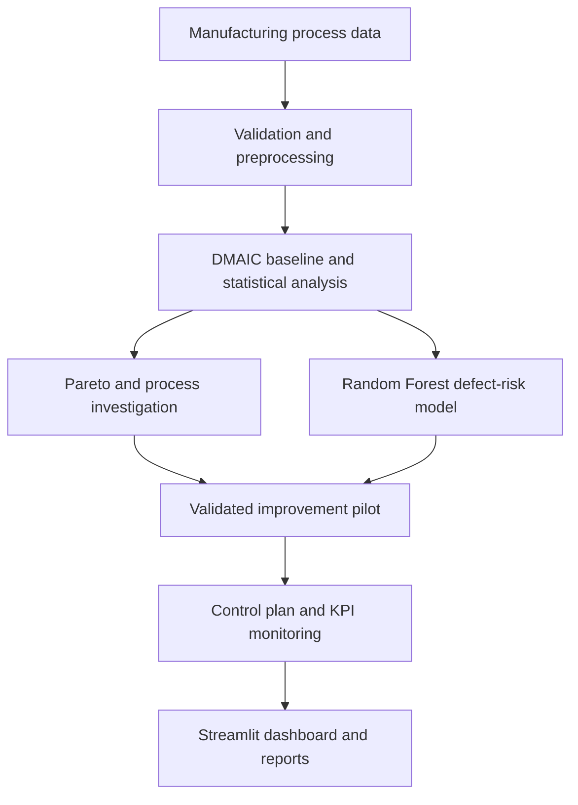

# System Architecture

```mermaid
flowchart TD
 A[Manufacturing process data] --> B[Validation and preprocessing]
 B --> C[DMAIC baseline and statistical analysis]
 C --> D[Pareto and process investigation]
 C --> E[Random Forest defect-risk model]
 D --> F[Validated improvement pilot]
 E --> F
 F --> G[Control plan and KPI monitoring]
 G --> H[Streamlit dashboard and reports]
```

The included code is a batch CSV demonstration, not a live Toyota production integration or industrial control system.
